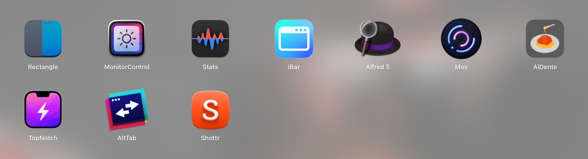
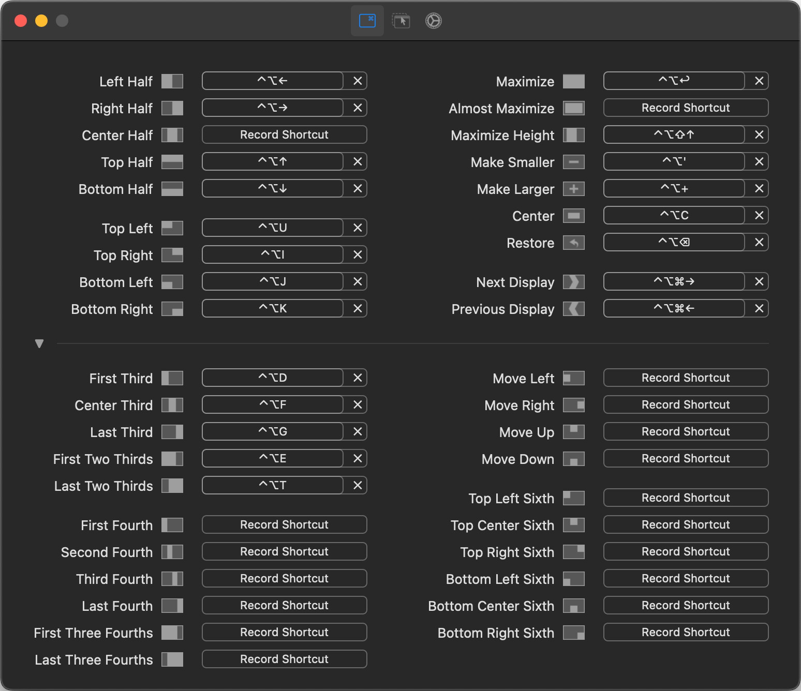
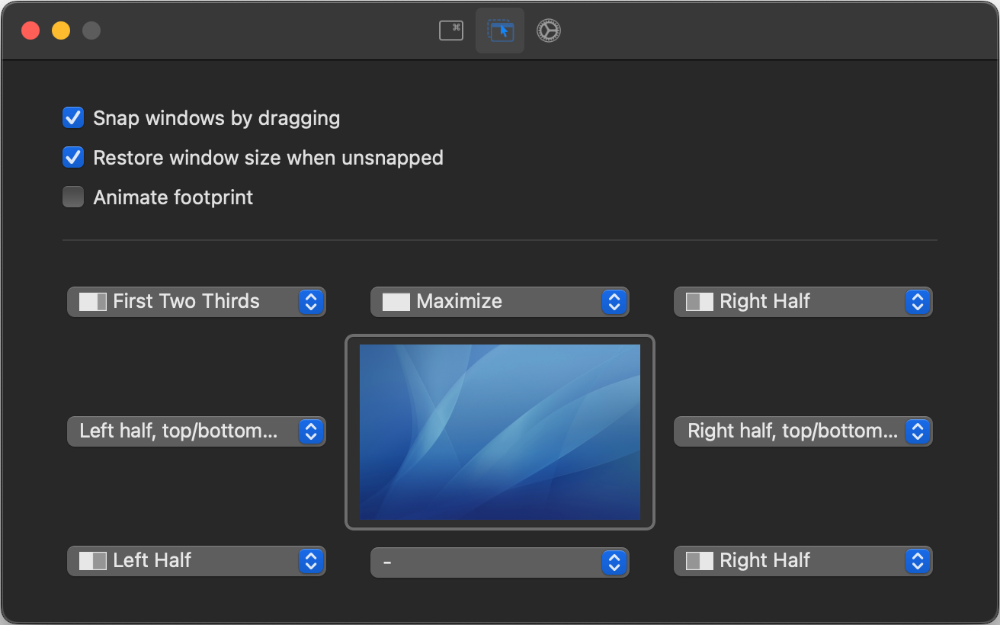

# Configurate your MACS

 

## What you can find here?
Here you can discover these essential apps and settings to optimize your **MacBook** or **Mac** for enhanced usability and productivity.

## Easily locate the content
- [Applications](#Applications)
  - [Subheading 1.1](#subheading-11)
  - [Subheading 1.2](#subheading-12)
- [Heading 2](#heading-2)
  - [Subheading 2.1](#subheading-21)
  - [Subheading 2.2](#subheading-22)

## Applications
Here are the applications I use most. Each serves a specific purpose, which I'll outline, and offers functionality that complements the default macOS utilities. All of these applications are set to **start at login**.

 

### Rectangle
Free and Open source app that allows to move and resize windows in macOS using keyboard shortcuts or snap areas.

#### My Configuration

Rectangle - configuration 1  

Rectangle - configuration 2  

[rectangleapp.com]("https://rectangleapp.com/")

### System Settings
Content for Subheading 1.2

## 