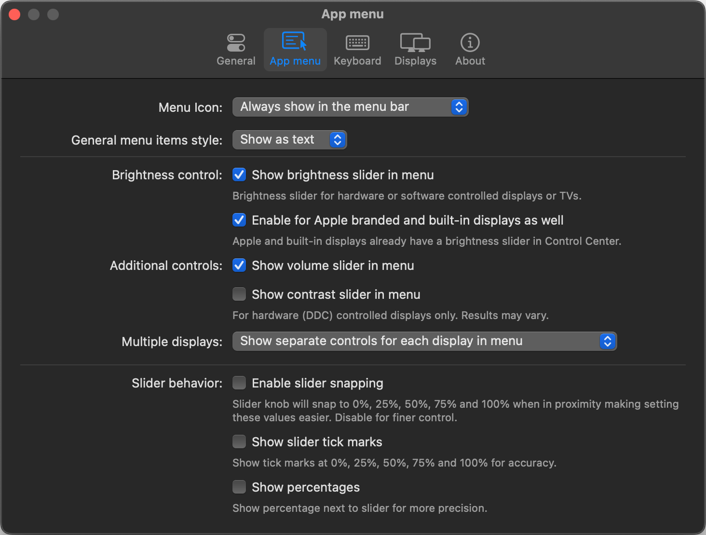
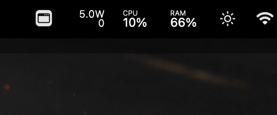
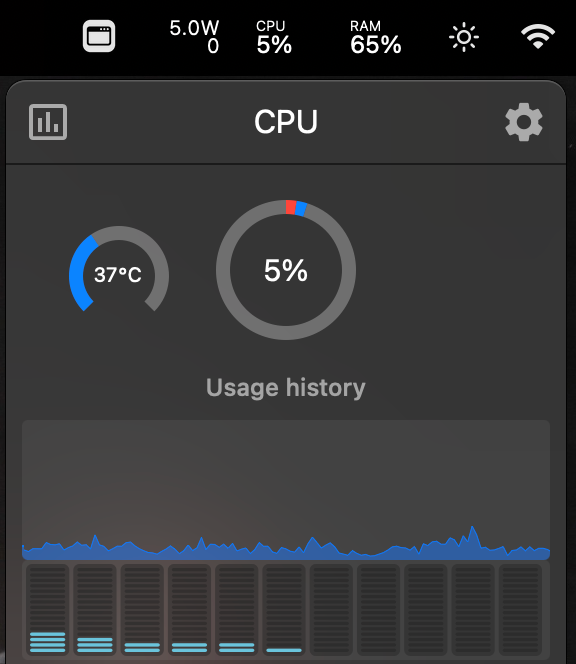
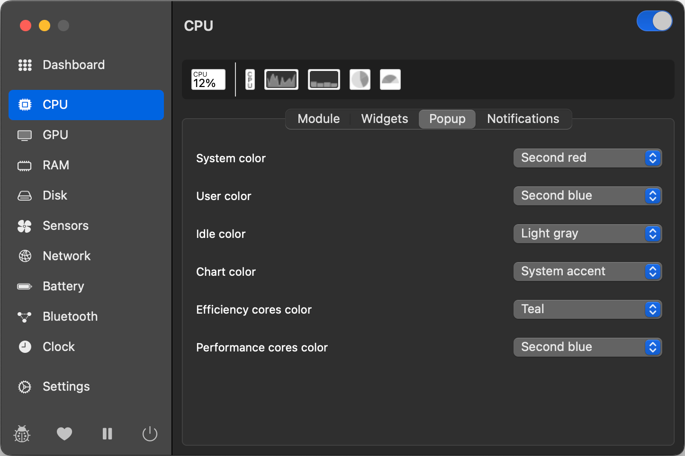
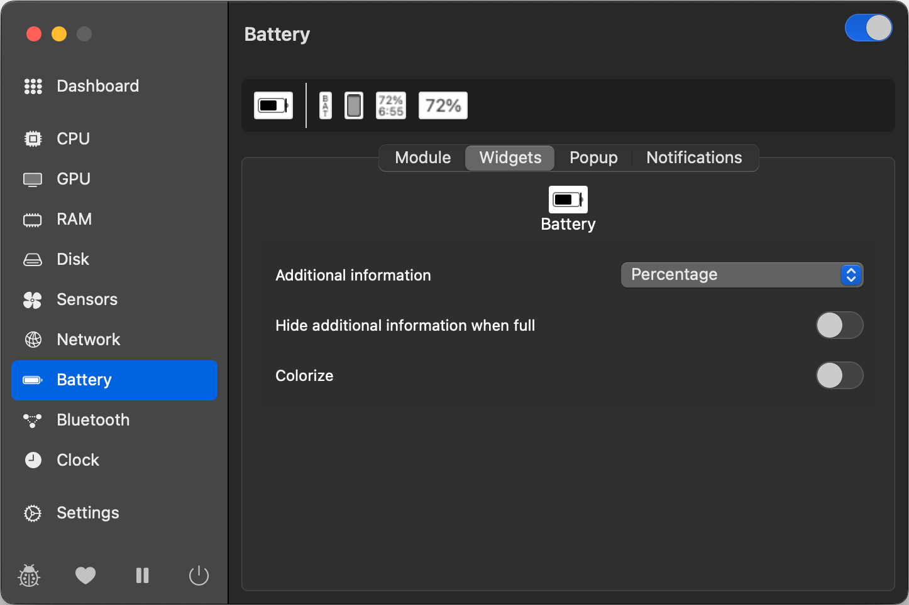
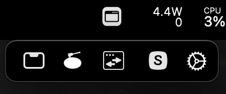

# Configurate your MACS

 

## What you can find here?
Here you can discover these essential apps and settings to optimize your **MacBook** or **Mac** for enhanced usability and productivity.

## Easily locate the content
- [Applications](#Applications)
  - [Rectangle](#rectangle)
  - [MonitorControl](#monitorcontrol)
  - [Stats](#stats)
- [Heading 2](#heading-2)
  - [Subheading 2.1](#subheading-21)
  - [Subheading 2.2](#subheading-22)

## Applications
Here are the applications I use most. Each serves a specific purpose, which I'll outline, and offers functionality that complements the default macOS utilities. All of these applications are set to **start at login**.

 

### Rectangle
Free and Open source app that allows to move and resize windows in macOS using keyboard shortcuts or snap areas. 

[rectangleapp.com]("https://rectangleapp.com/")

Rectangle - configuration 1  

Rectangle - configuration 2  

### MonitorControl
Free and Open source app that allows to control your display's brightness and volume on your Mac as if it was a native Apple Display.I particularly rely on it when connected to an external monitor.

[GitHub repository]("https://github.com/MonitorControl/MonitorControl")

MonitorControl - mockup  

MonitorControl - configuration  

### Stats
You might have noticed that my Mac's stats are now conveniently displayed in the status bar. It's all thanks to one of my favorite apps, which allows me to monitor nearly every component right from the menu bar.

[GitHub repository]("https://github.com/exelban/stats")

Stats - mockup  

Stats - monitors available  

> Personally, I mainly utilize the power, fan, CPU, and RAM usage features. However, there are plenty of other features available for you to explore at your own.

#### CPU monitor configuration
**⚠️ Warning: This content contains multiple images.**

Stats - cpu usage  

Stats - cpu configuration 1  

Stats - cpu configuration 2  

Stats - cpu configuration 3  

#### RAM monitor configuration

Stats - ram usage  

Stats - ram configuration 1  

Stats - ram configuration 2  

Stats - ram configuration 3  

#### FANS monitor configuration

Stats - fans usage (bottom) in RPM  

Stats - fans configuration 1  

Stats - fans configuration 2  

#### POWER monitor configuration

Stats - fans usage (top)  

Stats - power configuration 1  

Stats - power configuration 2  

### iBar
With the arrival of Apple Silicon processors, the introduction of the notch has led to limited space in the menu bar. This app enables you to group icons occupying space into a fixed folder directly on your menu bar.

iBar - mockup  

## System Settings