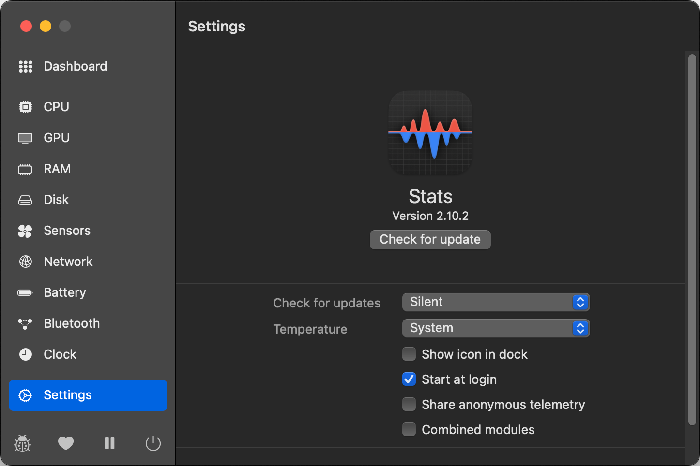
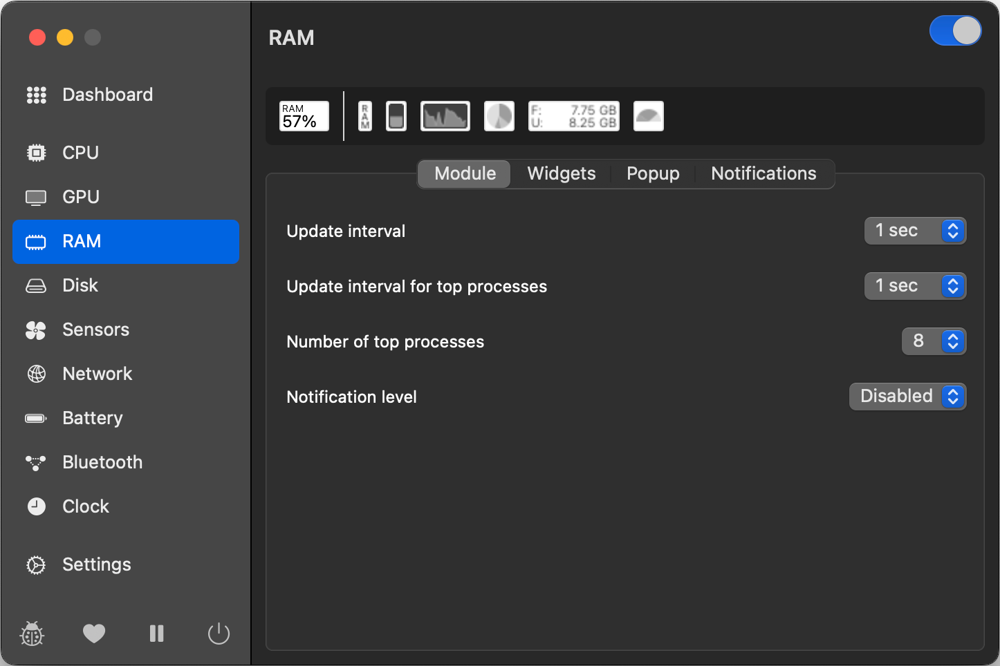
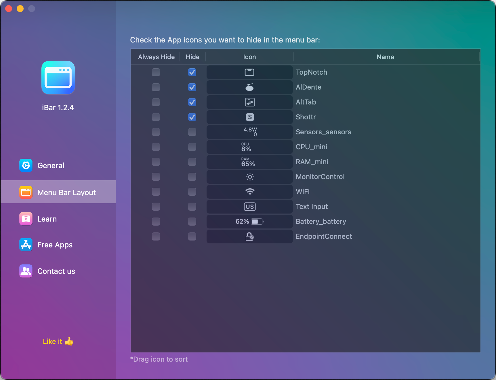
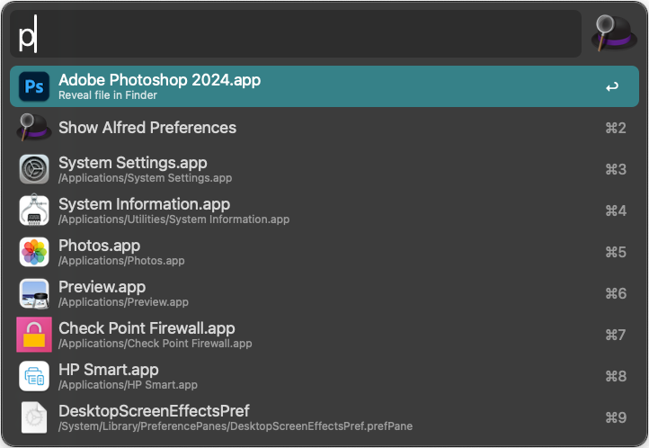
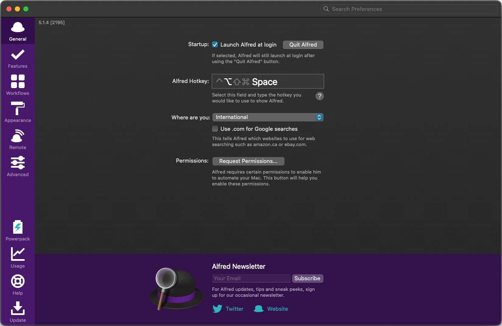
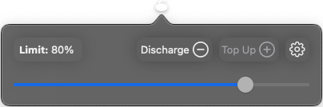
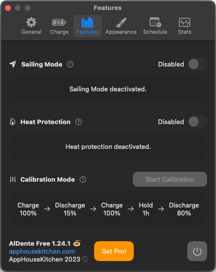
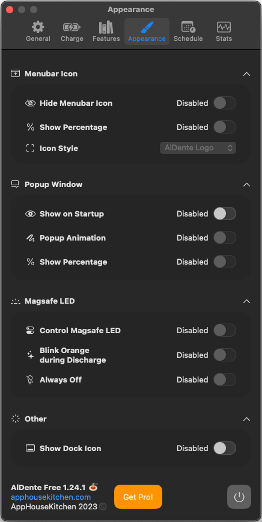

# Configurate your MACS

 

## What you can find here?
Here you can discover these essential apps and settings to optimize your **MacBook** or **Mac** for enhanced usability and productivity.

## Easily locate the content
- [Applications](#applications)
  - [Rectangle](#rectangle)
  - [MonitorControl](#monitorcontrol)
  - [Stats](#stats)
  - [iBar](#ibar)
  - [Alfred](#alfred)
  - [MOS](#mos)
  - [AlDente](#aldente)
  - [TopNotch](#topnotch)
  - [AltTab](#alttab)
  - [Shottr](#shottr)

- [System Settings](#system-settings)

## Applications
Here are the applications I use most. Each serves a specific purpose, which I'll outline, and offers functionality that complements the default macOS utilities. All of these applications are set to **start at login**.

 

### Rectangle
Free and Open source app that allows to move and resize windows in macOS using keyboard shortcuts or snap areas. 

[rectangleapp.com](https://rectangleapp.com/)

Rectangle - configuration 1  

Rectangle - configuration 2  

[⬅️ Back to Index](#easily-locate-the-content)

### MonitorControl
Free and Open source app that allows to control your display's brightness and volume on your Mac as if it was a native Apple Display.I particularly rely on it when connected to an external monitor.

[GitHub repository](https://github.com/MonitorControl/MonitorControl)

MonitorControl - menu bar  

MonitorControl - configuration  

[⬅️ Back to Index](#easily-locate-the-content)

### Stats
You might have noticed that my Mac's stats are now conveniently displayed in the status bar. It's all thanks to one of my favorite apps, which allows me to monitor nearly every component right from the menu bar.

[GitHub repository](https://github.com/exelban/stats)

Stats - menu bar  

Stats - monitors available  

> Personally, I mainly utilize the power, fan, CPU, and RAM usage features. However, there are plenty of other features available for you to explore at your own.

#### CPU monitor configuration
**⚠️ Warning: This content contains multiple images.**

Stats - cpu usage  

Stats - cpu configuration 1  

Stats - cpu configuration 2  

Stats - cpu configuration 3  

#### RAM monitor configuration

Stats - ram usage  

Stats - ram configuration 1  

Stats - ram configuration 2  

Stats - ram configuration 3  

#### FANS monitor configuration

Stats - fans usage (bottom) in RPM  

Stats - fans configuration 1  

Stats - fans configuration 2  

#### POWER monitor configuration

Stats - fans usage (top)  

Stats - power configuration 1  

Stats - power configuration 2  

### iBar
With the arrival of Apple Silicon processors, the introduction of the notch has led to limited space in the menu bar. This app enables you to group icons occupying space into a fixed folder directly on your menu bar.

iBar - menu bar  

In my case, I usually hide everything except the stats monitor.

iBar - configuration  

### Alfred
An upgraded version of Spotlight for Mac, offering enhanced search capabilities both locally and on the web, enabling more detailed and comprehensive searches.

[www.alfredapp.com](https://www.alfredapp.com/)

Alfred - search functionality  

Alfred - configuration  

[⬅️ Back to Index](#easily-locate-the-content)

### MOS
Frustrated with the default mouse scrolling direction on your Mac? This app allows you to reverse the "unnatural" external mouse scroll direction to your preference. Simply download and start using it hassle-free.

[mos.caldis.me](https://mos.caldis.me/)

MOS - configuration  

[⬅️ Back to Index](#easily-locate-the-content)

### AlDente
If you, like me, often keep your MacBook connected to the charger for extended periods, you might be concerned about the health of your battery. Continuous charging at 100% can potentially cause chemical and irreversible damage to the battery.

You may have also heard about the [lifespan of lithium-ion batteries](https://www.apple.com/batteries/why-lithium-ion/), typically around 1000 charge cycles. When your MacBook is constantly plugged in, the system may draw power from the battery even while it's charging, further accelerating its degradation.

Enter **Aldente** – this app offers a solution by allowing you to set a cap on your battery's charge and ensure that the system primarily draws power from the adapter rather than the battery. I highly recommend upgrading to the PRO version for deeper management of your Mac's battery health, although the free version is also enough for basic basic functionalities.

[GitHub repository](https://github.com/AppHouseKitchen/AlDente-Charge-Limiter)

Aldente - menu bar  

Aldente - system battery not charging  

Aldente - premium functionalities 1  

Aldente - premium functionalities 2  

Aldente - premium functionalities 3  

Aldente - premium functionalities 4  

[⬅️ Back to Index](#easily-locate-the-content)

### TopNotch
You can hide or show the notch on the new MacBooks as desired.

[topnotch.app](https://topnotch.app/)

Top Notch - disabled  

Top Notch - enabled  

[⬅️ Back to Index](#easily-locate-the-content)

### AltTab
It brings the power of Windows’s “alt-tab” window switcher to macOS or customize as you desired.

[alt-tab-macos.netlify.app](https://alt-tab-macos.netlify.app/)

Alt Tab - feature  

Alt Tab - configuration  

[⬅️ Back to Index](#easily-locate-the-content)

### Shottr
A multifunctional screenshot tool that offers a range of features to enhance your screenshot-taking experience. All the screenshots in this document were captured using Shottr.

[shottr.cc](https://shottr.cc/)

Shottr - configuration  

[⬅️ Back to Index](#easily-locate-the-content)

## System Settings