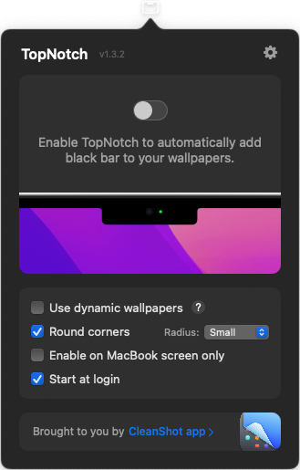
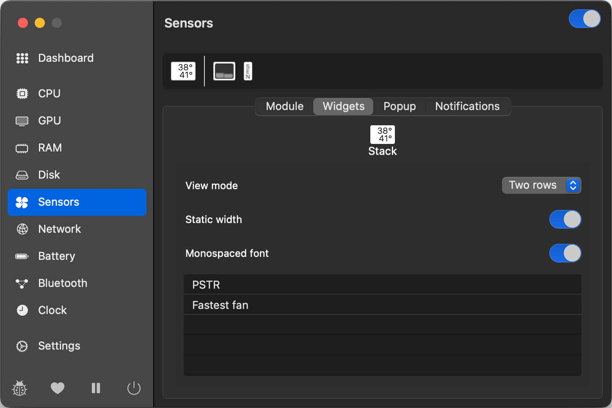

# Configurate your MAC

<p align="center"></p> 


## What you can find here?
Find essential apps and settings to make your **MacBook** or **Mac** more productive and easy to use.

## Device Information
These recommendations work best on the latest macOS versions and Apple Silicon devices. My setup:

- MacBook Pro M3 Pro
- macOS Sonoma & Sequoia

> Note: Always check for the latest app versions to ensure compatibility


## Content

- [Rectangle](#rectangle)      
- [TopNotch](#topnotch)          
- [Stats](#stats)                
- [XApp](#xapp)                  
- [MOS](#mos) ⭐️
- [AlDente](#aldente) ⭐️           
- [Shottr](#shottr)              
- [Clipy](#clipy)                
- [AltTab](#alttab)              
- [BetterDisplay](#betterdisplay)
- [Amazon Q](#amazon-q) ⭐️         
- [Ice](#ice) ⭐️                   
- [System Settings](#system-settings)
  - [Dock Hide/Show Animation Speed](#dock-speed)


> ⭐️ Apps highly recommended


## Applications
Here are the applications I use most. Each serves a specific purpose, which I'll outline, and offers functionality that complements the default macOS utilities.

<p align="center"></p> 


---


### Rectangle
Free and Open source app that allows to move and resize windows like in Windows, using keyboard shortcuts or snap areas.

> Note: this feature has been added to the newest macOS Sequoia system. So, it's more recommended to those who are still using older OS versions, like me.

<a href="https://rectangleapp.com/"></a>

<p align="center">
<p align="center" justify="center">Rectangle - configuration 1<br><br />


<p align="center">
<p align="center" justify="center">Rectangle - configuration 2<br><br />

[⬅️ Back to Index](#content)


---


### TopNotch
allows you to hide or reveal the notch on the new MacBooks as desired.

<a href="https://topnotch.app/"></a>

<p align="center">
<p align="center" justify="center">Top Notch - disabled<br><br />

<p align="center">
<p align="center" justify="center">Top Notch - enabled<br><br />

[⬅️ Back to Index](#content)


---


### Stats
Displays real-time stats about the Mac in the menu bar. It allows you monitor power usage, fan speed, CPU, RAM, etc.

<a href="https://github.com/exelban/stats"></a>

<p align="center">
<p align="center" justify="center">Stats - menu bar<br><br />

<p align="center">
<p align="center" justify="center">Stats - monitors available<br><br />

> I mainly use the power, fan, CPU, and RAM features, but there are many more for you to explore.

#### CPU monitor configuration
**⚠️ Warning: This content contains multiple images.**

<p align="center">
<p align="center" justify="center">Stats - cpu usage<br><br />

<p align="center">
<p align="center" justify="center">Stats - cpu configuration 1<br><br />

<p align="center">
<p align="center" justify="center">Stats - cpu configuration 2<br><br />

<p align="center">
<p align="center" justify="center">Stats - cpu configuration 3<br><br />

#### RAM monitor configuration

<p align="center">
<p align="center" justify="center">Stats - ram usage<br><br />

<p align="center">
<p align="center" justify="center">Stats - ram configuration 1<br><br />

<p align="center">
<p align="center" justify="center">Stats - ram configuration 2<br><br />

<p align="center">
<p align="center" justify="center">Stats - ram configuration 3<br><br />

#### FANS monitor configuration

<p align="center">
<p align="center" justify="center">Stats - fans usage (bottom) in RPM<br><br />

<p align="center">
<p align="center" justify="center">Stats - fans configuration 1<br><br />

<p align="center">
<p align="center" justify="center">Stats - fans configuration 2<br><br />

#### POWER monitor configuration
<p align="center">
<p align="center" justify="center">Stats - fans usage (top)<br><br />

<p align="center">
<p align="center" justify="center">Stats - power configuration 1<br><br />

<p align="center">
<p align="center" justify="center">Stats - power configuration 2<br><br />

[⬅️ Back to Index](#content)


---


### XApp
A powerful cleaner that helps you uninstall apps completely by removing caches and all related files.

<a href="https://www.better365.cn/xapp.html"></a>

<p align="center">
<p align="center" justify="center">XApp - Interface<br><br />

[⬅️ Back to Index](#content)


---


### MOS
For users who are frustrated with the default mouse scrolling direction on Mac, MOS allows them to reverse the scrolling direction and make the mouse usage in Mac **natural**.

<a href="https://mos.caldis.me/"></a>

<p align="center">
<p align="center" justify="center">MOS - configuration<br><br />

[⬅️ Back to Index](#content)


---


### AlDente
If you, like me, often keep your MacBook connected to the charger for extended periods, you might be concerned about the health of your battery. Continuous charging at 100% **can potentially cause chemical and irreversible damage to the battery**.

> You may have also heard about the [lifespan of lithium-ion batteries](https://www.apple.com/batteries/why-lithium-ion/), typically around 1000 charge cycles. When your MacBook is constantly plugged in, the system may draw power from the battery even while it's charging, further accelerating its degradation.

**Aldente** helps protect battery health by limiting the maximum charge, ensuring the MacBook draws power primarily from the adapter rather than the battery.

<a href="https://github.com/AppHouseKitchen/AlDente-Charge-Limiter"></a>

<p align="center">
<p align="center" justify="center">Aldente - menu bar<br><br />

<p align="center">
<p align="center" justify="center">Aldente - system battery not charging<br><br />

<p align="center">
<p align="center" justify="center">Aldente - premium functionalities 1<br><br />

<p align="center">
<p align="center" justify="center">Aldente - premium functionalities 2<br><br />

<p align="center">
<p align="center" justify="center">Aldente - premium functionalities 3<br><br />

<p align="center">
<p align="center" justify="center">Aldente - premium functionalities 4<br><br />

[⬅️ Back to Index](#content)


---


### Shottr
A multifunctional screenshot tool that offers a range of features to enhance your screenshot-taking experience. All the screenshots in this document were captured using Shottr.

<a href="https://shottr.cc/"></a>

<p align="center">
<p align="center" justify="center">Shottr - configuration<br><br />

[⬅️ Back to Index](#content)


---


### Clipy
Allows you to store and access previously copied content.

<a href="https://clipy-app.com/"></a>

<p align="center">
<p align="center" justify="center">Clipy - interface<br><br />

[⬅️ Back to Index](#content)


---


### AltTab
It brings the power of Windows’s **alt-tab** window switcher to macOS or customize as you desired.

<a href="https://alt-tab-macos.netlify.app/"></a>

<p align="center">
<p align="center" justify="center">Alt Tab - feature<br><br />

<p align="center">
<p align="center" justify="center">Alt Tab - configuration<br><br />

[⬅️ Back to Index](#content)


---


### BetterDisplay
**Unlock your displays on your Mac!**

Flexible HiDPI scaling, XDR/HDR extra brightness, virtual screens, DDC control, extra dimming, PIP/streaming, EDID override and lots more!

Control your display by yourself.

<a href="https://github.com/waydabber/BetterDisplay/tree/landing"></a>

<p align="center">
<p align="center" justify="center">BetterDisplay - some features<br><br />

[⬅️ Back to Index](#content)


---


### Amazon Q
Amazon Q (previously known as __CodeWhisperer__) is an AI tool designed for enhancing shell command line interactions. It offers a range of functionalities including personalized code completions, inline documentation, and translation of natural language into code. 

Currently, it is exclusively available for macOS, so enjoy it :)

<a href="https://docs.aws.amazon.com/amazonq/latest/qdeveloper-ug/command-line-getting-started-installing.html"></a>

<p align="center">
<p align="center" justify="center">Code Whisperer - IDE-style completions<br><br />

<p align="center">
<p align="center" justify="center">Code Whisperer - Natural language-to-bash translation<br><br />

[⬅️ Back to Index](#content)


---


### Ice
Enables you to group icons occupying space into a fixed folder directly on your menu bar.

<a href="https://github.com/jordanbaird/Ice"></a>

<p align="center">
<p align="center" justify="center">Ice - icon in menu bar<br><br />


[⬅️ Back to Index](#content)


## System Settings

### Dock Speed
Occasionally, the Mac dock occupies space on our desktop. You can use the key combination **⌥⌘D** to hide/show the dock. However, the animation for the dock to reappear is too slow.

- To make the Dock **instantly** leap back into view when it’s needed, rather than slide, type the following in your terminal:
```bash
defaults write com.apple.dock autohide-time-modifier -int 0; killall Dock
```

- If you’d like the animation for the dock to reappear to last for a **split-second**, try the following:
```bash
defaults write com.apple.dock autohide-time-modifier -float 0.15; killall Dock
```

> To explain, changing "0.15" with any number can let you tailor things as it represents the time in seconds taken for the dock to reappear fully.

- To **revert back** to the default sliding effect, type the following:
```bash
defaults delete com.apple.dock autohide-time-modifier; killall Dock
```

[⬅️ Back to Index](#content)


## Notes
I will keep an eye on this repository and make updates as needed.

