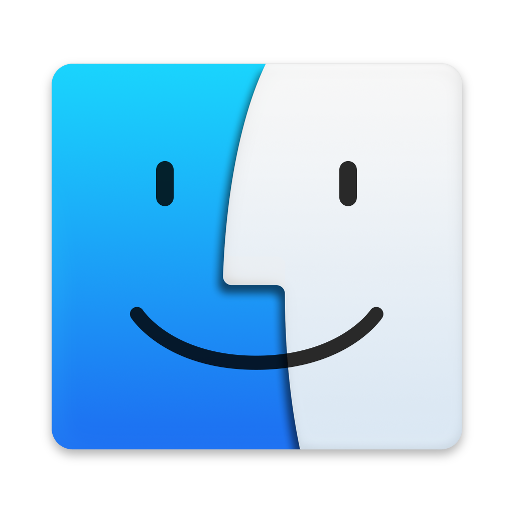
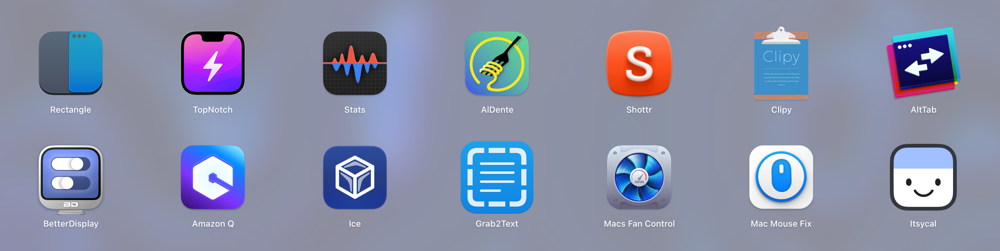

# 设置您的 MAC
<p align="center"></p> 

<p align="center">
<a href="README_CN.md"></a>
<a href="../README.md"></a>
</p>

## 您能在这里找到什么？
在这里，你可以发现一些基本的应用程序和设置，优化你的**MacBook**或**Mac**，提高可用性和生产力。

## 兼容性信息
虽然这些应用程序和系统设置旨在适用于最新的 macOS 版本和 Apple Silicon 处理器，但可能偶尔会出现兼容性问题。我的设备：

- MacBook Pro M3 Pro
- macOS Sonoma

> 虽然我们努力确保兼容性，但并不保证百分之百有效。
> 此外，请务必检查上述应用程序的最新版本。


## 轻松定位内容
- [应用程序](#应用程序)
  - [Rectangle](#rectangle)
  - [MonitorControl](#monitorcontrol)
  - [Stats](#stats)
  - [iBar](#ibar)
  - [Alfred](#alfred)
  - [MOS](#mos)
  - [AlDente](#aldente)
  - [TopNotch](#topnotch)
  - [AltTab](#alttab)
  - [Shottr](#shottr)

- [系统设置](#系统设置)
  - [Dock栏响应速度](#dock栏响应速度)

- [贡献](#贡献)

## 应用程序
以下是我最常用的应用程序。每个应用程序都有其特定用途，并提供补充 macOS 默认实用工具的功能。所有这些应用程序都设置为**登录时启动**。

<p align="center"></p> 

### Rectangle
免费的开源应用程序，允许使用键盘快捷键或抓取区域在 macOS 中移动和调整窗口大小。

<a href="https://rectangleapp.com/"></a>

<p align="center">
<p align="center" justify="center">Rectangle - configuration 1<br><br />


<p align="center">
<p align="center" justify="center">Rectangle - configuration 2<br><br />

[⬅️ 返回索引](#轻松定位内容)

### MonitorControl
这款免费的开源应用程序可以在 Mac 上控制显示器的亮度和音量，就像控制苹果显示器一样。

<a href="https://github.com/MonitorControl/MonitorControl"></a>

<p align="center">
<p align="center" justify="center">MonitorControl - menu bar<br><br />

<p align="center">
<p align="center" justify="center">MonitorControl - configuration<br><br />

[⬅️ 返回索引](#轻松定位内容)

### Stats
你可能已经注意到，我的 Mac 的统计数据现在可以方便地显示在状态栏中。这都要归功于我最喜欢的一款应用程序，它让我可以直接从菜单栏监控几乎所有组件。

<a href="https://github.com/exelban/stats"></a>

<p align="center">
<p align="center" justify="center">Stats - menu bar<br><br />

<p align="center">
<p align="center" justify="center">Stats - monitors available<br><br />

> 我个人主要使用电源、风扇、CPU 和内存使用情况功能。不过，还有很多其他功能可供您自行探索。

#### CPU 监控配置
**⚠️ 警告： 此内容包含多个图像。**

<p align="center">
<p align="center" justify="center">Stats - cpu usage<br><br />

<p align="center">
<p align="center" justify="center">Stats - cpu configuration 1<br><br />

<p align="center">
<p align="center" justify="center">Stats - cpu configuration 2<br><br />

<p align="center">
<p align="center" justify="center">Stats - cpu configuration 3<br><br />

#### RAM 监视器配置

<p align="center">
<p align="center" justify="center">Stats - ram usage<br><br />

<p align="center">
<p align="center" justify="center">Stats - ram configuration 1<br><br />

<p align="center">
<p align="center" justify="center">Stats - ram configuration 2<br><br />

<p align="center">
<p align="center" justify="center">Stats - ram configuration 3<br><br />

#### 风扇监视器配置

<p align="center">
<p align="center" justify="center">Stats - fans usage (bottom) in RPM<br><br />

<p align="center">
<p align="center" justify="center">Stats - fans configuration 1<br><br />

<p align="center">
<p align="center" justify="center">Stats - fans configuration 2<br><br />

#### 电源监控器配置
<p align="center">
<p align="center" justify="center">Stats - fans usage (top)<br><br />

<p align="center">
<p align="center" justify="center">Stats - power configuration 1<br><br />

<p align="center">
<p align="center" justify="center">Stats - power configuration 2<br><br />

[⬅️ 返回索引](#轻松定位内容)

### iBar
随着苹果硅处理器的问世，刘海的引入导致菜单栏空间有限。有了这款 app，你可以直接在菜单栏上将占据空间的图标归类到一个固定的文件夹中。

<a href="https://apps.apple.com/pt/app/ibar-menubar-icon-control-tool/id6443843900?l=en-GB&mt=12"></a>

<p align="center">
<p align="center" justify="center">iBar - menu bar<br><br />

就我而言，我通常会隐藏除统计监视器之外的所有内容。
<p align="center">
<p align="center" justify="center">iBar - configuration<br><br />

[⬅️ 返回索引](#轻松定位内容)

### Alfred
Mac 版 Spotlight 的升级版本，增强了本地和网络搜索功能，可进行更详细、更全面的搜索。

<a href="https://www.alfredapp.com/"></a>

<p align="center">
<p align="center" justify="center">Alfred - search functionality<br><br />

<p align="center">
<p align="center" justify="center">Alfred - configuration<br><br />

[⬅️ 返回索引](#轻松定位内容)

### MOS
对 Mac 上默认的鼠标滚动方向感到沮丧？有了这款应用程序，你就可以根据自己的喜好，扭转 "不自然 "的外部鼠标滚动方向。只需下载，即可轻松使用。

<a href="https://mos.caldis.me/"></a>

<p align="center">
<p align="center" justify="center">MOS - configuration<br><br />

[⬅️ 返回索引](#轻松定位内容)

### AlDente
如果你和我一样，经常将 MacBook 长期连接到充电器上，你可能会担心电池的健康状况。持续 100% 充电可能会对电池造成化学和不可逆的损害。

您可能还听说过[锂离子电池的使用寿命](https://www.apple.com/batteries/why-lithium-ion/)，通常约为 1000 个充电周期。当你的 MacBook 一直插在电源插座上时，即使在充电过程中，系统也可能从电池中汲取电能，从而进一步加速电池的老化。

回到**Aldente** - 这款应用程序提供了一种解决方案，它允许你设置电池电量上限，确保系统只从电源而不是电池中获取能量。我强烈建议升级到专业版，以便对 Mac 的电池健康状况进行更深入的管理，不过免费版也足以满足基本的基础功能需求。

<a href="https://github.com/AppHouseKitchen/AlDente-Charge-Limiter"></a>

<p align="center">
<p align="center" justify="center">Aldente - menu bar<br><br />

<p align="center">
<p align="center" justify="center">Aldente - system battery not charging<br><br />

<p align="center">
<p align="center" justify="center">Aldente - premium functionalities 1<br><br />

<p align="center">
<p align="center" justify="center">Aldente - premium functionalities 2<br><br />

<p align="center">
<p align="center" justify="center">Aldente - premium functionalities 3<br><br />

<p align="center">
<p align="center" justify="center">Aldente - premium functionalities 4<br><br />

[⬅️ 返回索引](#轻松定位内容)

### TopNotch
你可以根据需要在新款 MacBook 上隐藏或显示刘海。

<a href="https://topnotch.app/"></a>

<p align="center">
<p align="center" justify="center">Top Notch - disabled<br><br />

<p align="center">
<p align="center" justify="center">Top Notch - enabled<br><br />

[⬅️ 返回索引](#轻松定位内容)

### AltTab
它为 macOS 带来了 Windows "alt-tab "窗口切换器的强大功能，也可以根据需要进行自定义。

<a href="https://alt-tab-macos.netlify.app/"></a>

<p align="center">
<p align="center" justify="center">Alt Tab - feature<br><br />

<p align="center">
<p align="center" justify="center">Alt Tab - configuration<br><br />

[⬅️ 返回索引](#轻松定位内容)

### Shottr
一款多功能截图工具，提供一系列功能来增强你的截图体验。本文档中的所有截图都是使用 Shottr 截取的。

<a href="https://shottr.cc/"></a>

<p align="center">
<p align="center" justify="center">Shottr - configuration<br><br />

[⬅️ 返回索引](#轻松定位内容)

## 系统设置

### Dock栏响应速度
Mac Dock栏有时会占用桌面空间。你可以使用组合键**⌥⌘D**来隐藏/显示 Dock。不过，Dock 重新出现的动画速度太慢。

- 要让 Dock 在需要时**立即**跃回视图，而不是滑动，请在终端中键入以下内容：
```bash
defaults write com.apple.dock autohide-time-modifier -int 0; killall Dock
```

- 如果想让重新出现的动画**持续几秒**，请在终端中键入以下内容：
```bash
defaults write com.apple.dock autohide-time-modifier -float 0.15; killall Dock
```

> 要解释一下，用任何数字改变 "0.15 "都可以让你进行调整，因为它代表了停靠点完全重现所需的时间（以秒为单位）。

- 要**恢复**默认的滑动效果，请键入以下内容：
```bash
defaults delete com.apple.dock autohide-time-modifier; killall Dock
```

[⬅️ 返回索引](#轻松定位内容)


## 贡献  
我将关注此repository，并根据需要进行升级。我们鼓励并欢迎贡献，请随时根据需要进行调整和修改。

